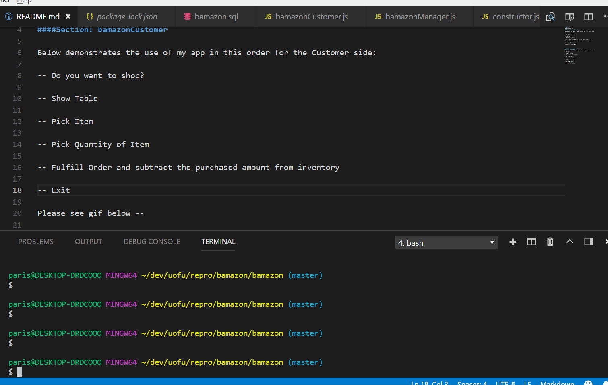
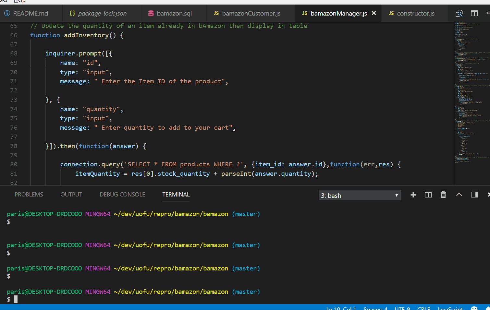

# bamazon
bamazon homework 12

####Section: bamazonCustomer

Below demonstrates the use of my app in this order for the Customer side:

-- Do you want to shop?

-- Show Table

-- Pick Item

-- Pick Quantity of Item

-- Fulfill Order and Subtract the Purchased Amount from Inventory

-- Show Total Cost

-- Exit 

Please see gif below --

####Section: bamazonManager
Below demonstrates the use of my app in this order for the Manager side:

1: View Items

2: View Low Inventory

3: Add Inventory to Current Items

4: Add Product to Table

5: Delete Product from Table

6: Exit 

Please see gif below --

